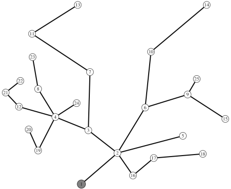
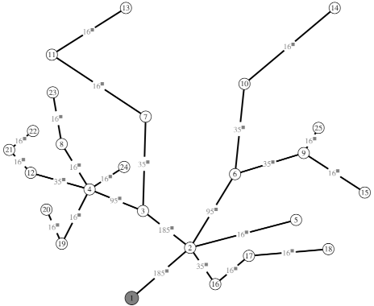

## Conductor Size Selection in Radial Distribution Networks Using Robust Optimization

This program solves a problem for optimal conductor size selection in a
radial distribution network with a predefined topology. The optimization
method is developed through the adaptation of the column and constraint
generation algorithm, which finds application in solving general
mathematical problems in the field of robust optimization. The objective
of the optimization is to determine the conductor size for each line in
the network in such a way that the annual costs for construction and
energy losses in the network are minimal. Additionally, it is imperative
to satisfy all technical constraints even in a case of worst realization
of uncertain consumption. The uncertain consumption is modelled by two
values, the so-called uncertainty set. The uncertainty set represents
the minimum and maximum value of the peak power demand at each node in
the distribution network.

The code is written in python, and pyomo library was used for
optimization model creation. The problem is solved using "CPLEX" solver,
but it can easily adapted for other available commercial solvers. There
are several files in the repository, such as:

-   "models_cssr.py": in this file there are three functions: one for
    solving the problem with deterministically modeled load, one for
    solving the subproblem and the last function for solving the master
    problem;

-   "routing_cssr.py": in this file, a function is created with the name
    "robust_optimization (CASE_FILE, GAMMA)". By calling this function,
    appropriate function from the "models_cssr.py" is called, as a
    function from the iteration number. After the conditions for
    terminating the iteration process are fulfilled, the solution is
    then stored under "routing.py";

-   "plot.py': in this file we create two different ".txt" files, that
    can be used for plotting the solution with LaTex;

-   "caseXX_cssr.py": number of different files, where XX stands for
    distribution network case number.

A simple medium voltage distribution network is shown in following Fig.
1 where node 1 is the slack (supply) node and there are loads connected
to all 24 nodes.

Fig.1 Medium voltage distribution network graph

The purpose of the program is to give optimal solution for each line
shown on Fig. 1, according to different conductor cross-section data
presented in the case file. Beside conductor's cross-section, in the
case file, additional information is provided, such as: line impedance,
maximum current caring capacity, cost for conductor installment, network
topology, lines length, load data and XY coordinates for each bus that
can be later used to plot the solution.

In order to solve the problem, firstly, in line 182 from file
"routing_cssr.py', one must specify the distribution network case
number, such as:

`CASE_FILE = 'case24_cssr.py'`

Also, one must provide value for the parameter GAMMA, in a range from 0
to 1. After saving the file, and navigating to the file directory, it
can be executed by running the following command in the terminal:

`python routing_cssr.py`

The results are then stored in the "routing.log" file, where we store
the following data from each iteration:

-   time needed to solve each iteration,

-   objective function value,

-   annual investment costs for building the network,

-   annual cost for energy loss,

-   obtained voltage values for each node,

-   uncertain power demand realization for each node,

-   value for the binary system variable *v*.

Solution for "case24_cssr.py", when GAMMA=1, is depicted on Fig. 2.

Fig.2 Medium voltage distribution network solution for GAMMA=1
